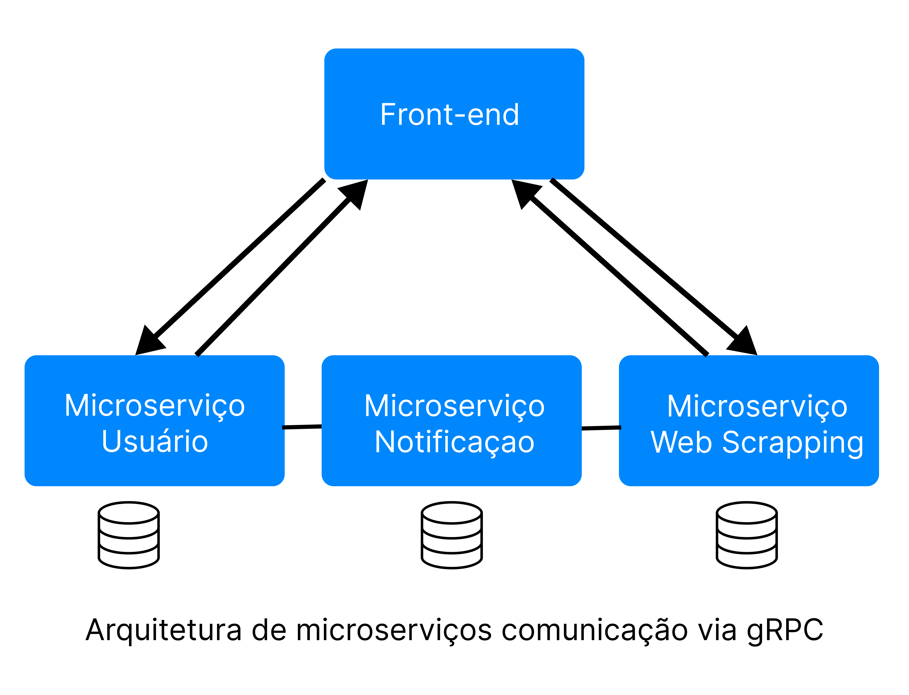

# Front-End Microservices Orchestrator


Este projeto é uma aplicação front-end desenvolvida para orquestrar múltiplos microserviços. Utiliza React e está configurada para construir e servir uma aplicação que pode se comunicar com diversos microserviços. O projeto segue a arquitetura de componentização para melhorar a manutenção e a reutilização do código.

## Visão Geral

- **Componentização**: A aplicação é construída com uma abordagem modular, utilizando componentes reutilizáveis.
- **Docker**: Inclui um Dockerfile para empacotar e executar a aplicação em um contêiner.
- **Css**: Tailwind

## Pré-requisitos

- Node.js 18.x ou superior
- NPM ou Yarn
- Docker (opcional, para execução em contêiner)

## Estrutura do Projeto

- **`src/`**: Contém o código-fonte da aplicação.
- **`public/`**: Arquivos públicos e estáticos.
- **`Dockerfile`**: Arquivo de configuração para construir e servir a aplicação com Docker.
- **`package.json`**: Gerencia as dependências e scripts da aplicação.

## Instalação

### Clonando o Repositório

```bash
git clone https://github.com/seu_usuario/seu_repositorio.git](https://github.com/Marciohenr1que/MicroService_front
Configuração do Ambiente
Instale as dependências:

Se estiver usando NPM:

bash
Copiar código
npm install
Ou, se estiver usando Yarn:

bash
Copiar código
yarn install
Execute a aplicação em modo de desenvolvimento:

Se estiver usando NPM:

bash
Copiar código
npm run dev
Ou, se estiver usando Yarn:

bash
Copiar código
yarn start
A aplicação estará disponível em http://localhost:5173.

Construção e Execução com Docker
Construa a imagem Docker:

bash
Copiar código
docker-compose build
Execute o contêiner Docker:

bash
Copiar código
docker-compose up
A aplicação estará disponível em http://localhost:5173.

Componentização
O projeto utiliza uma abordagem baseada em componentes. Recomendações incluem:

Separação de Preocupações: Mantenha os componentes pequenos e focados em uma única responsabilidade.
Reutilização: Desenvolva componentes modulares que possam ser reutilizados em diferentes partes da aplicação.
Documentação: Documente os componentes e suas propriedades para facilitar a manutenção e o entendimento.
Scripts Disponíveis
npm run dev: Inicia a aplicação em modo de desenvolvimento.
npm run build: Constrói a aplicação para produção.
npm run start

```
